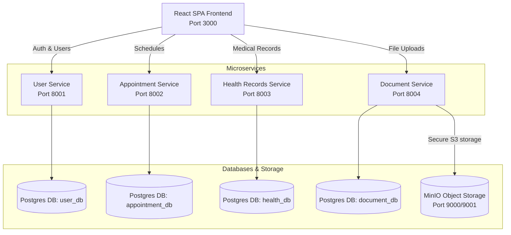

# 🏥 MediLink Hub

Welcome to **MediLink Hub**, a premium, production-grade microservices-based healthcare platform designed to streamline doctor-patient scheduling, medical record tracking, and secure clinical document management. 

Featuring a modern **Glassmorphism SPA Dashboard** built in React (Vite) and orchestrating multiple independent **FastAPI microservices** using Docker, this platform is optimized for local development and ready for Amazon EKS deployment.

---

## 🏗️ Architecture Overview

MediLink Hub is architected following strict microservices principles. Each service runs in isolation, manages its own dedicated PostgreSQL database, and communicates via defined REST APIs.



---

## 🌟 Key Features

### 🔐 User Service & RBAC (Port `8001`)
* **Role-Based Access Control (RBAC):** Strictly distinguishes between `patient`, `doctor`, and `admin` accounts.
* **Token Authentication:** Secure JWT-based session handling.
* **Security & Input Guardrails:** Hardened against high-entropy bcrypt limits (72-byte strict length validation & programmatic truncation).

### 📅 Appointment Scheduling (Port `8002`)
* **Interactive Booking Engine:** Custom mini-calendar and time-slot allocator designed for seamless UX.
* **Timezone Safety:** Active normalization converting incoming ISO strings to offset-naive UTC dates to prevent comparison conflicts with PostgreSQL.
* **State Management:** Fully supports creating, pending, approving, and canceling clinical appointments.

### 🩺 Health Records (Port `8003`)
* **Doctor Privilege Only:** Only accounts with the `doctor` role are permitted to create health logs and diagnostics.
* **Patient View Only:** Patients can securely view their records but cannot mutate or add medical histories.

### 📁 Clinical Document Management (Port `8004`)
* **Object Store Integration:** Seamless connection to **MinIO** (S3 compatible) for uploading and retrieving medical attachments.
* **Safe Storage Paths:** Dynamically creates buckets (`medilink-docs`) and tracks file metadata securely in PostgreSQL.

### 🎨 Premium Frontend Dashboard (Port `3000`)
* **Modern Design Language:** Tailored Glassmorphism aesthetics with deep HSL dark modes, responsive layouts, and rich micro-interactions.
* **Zero Page-Reloads:** Utilizes React Router for highly responsive SPA routing.
* **Interactive Widgets:** A bespoke mini calendar & scrollable 30-minute interval time grid replacing native date pickers.

---

## 🛠️ Technology Stack

| Layer | Component | Technologies |
| :--- | :--- | :--- |
| **Frontend** | UI & SPA Logic | React (Vite), React Router v6, Lucide React, HSL Custom Variables |
| **Backend** | API Services | FastAPI, Pydantic v2, SQLAlchemy, Uvicorn |
| **Databases** | Relational Storage | PostgreSQL 15 (dedicated databases) |
| **Object Store**| File Repository | MinIO (Amazon S3 API Compatible) |
| **Orchestration**| Container Management | Docker, Docker Compose |

---

## 🚀 Quick Start Guide

### 📋 Prerequisites
Make sure you have the following installed on your system:
* [Docker Desktop](https://www.docker.com/products/docker-desktop/) (includes Compose)
* [Git](https://git-scm.com/)

### ⚡ Step-by-Step Launch
1. **Clone the Repository:**
   ```bash
   git clone https://github.com/yourusername/medilink-hub.git
   cd medilink-hub
   ```

2. **Boot the Local Stack:**
   ```bash
   docker compose up --build
   ```
   *This command will automatically download the necessary images, build all FastAPI services and the React frontend, spin up PostgreSQL and MinIO databases, execute health checks, and expose the services locally.*

3. **Verify running containers:**
   ```bash
   docker compose ps
   ```

4. **Access the Apps:**
   * **React Dashboard UI:** [http://localhost:3000](http://localhost:3000)
   * **MinIO Storage Console:** [http://localhost:9001](http://localhost:9001) (User: `minio` | Password: `minio123`)

---

## 🔑 Test Credentials

To test role-based capabilities, you can register or log in using these preset accounts:

### 🩺 Doctor Account (Can write Health Records, Cannot Book Appointments)
* **Email:** `doctor@medilink.com`
* **Password:** `password123`
* **Role:** `doctor`

### 👤 Patient Account (Can Book Appointments, Cannot Write Health Records)
* **Email:** `patient@medilink.com`
* **Password:** `password123`
* **Role:** `patient`

---

## 🔧 Developing Locally & Hot-Reload

The `docker-compose.yml` config is optimized for swift local development:
* **Frontend Hot Reload:** The source files are volume-mounted (`./frontend/src:/app/src`), meaning edits to any React component instantly reflect in your browser.
* **Independent Rebuilds:** If you alter backend code in `appointment-service`, run:
  ```bash
  docker compose up --build -d appointment-service
  ```

---

## 🛠️ Troubleshoot & Fix Reference

Below are fixes for issues resolved during production testing:
* **Bcrypt Incompatibility:** Pinned `bcrypt==3.2.2` alongside `passlib[bcrypt]==1.7.4` to avoid `AttributeError: module 'bcrypt' has no attribute '__about__'`.
* **DateTime Shadowing:** Avoided namespace clashes in SQLAlchemy models by importing standard datetimes as `import datetime as dt`.
* **Datetime Timezone Clashes:** Programmatically converted timezone-aware ISO string formats into offset-naive UTC dates inside `appointment-service` validator checks prior to inserting into PostgreSQL tables.


## ☁️ AWS 3-Tier Production Architecture

MediLink Hub is deployed on AWS using a production-grade 3-tier architecture spanning two Availability Zones in `us-east-1`, fully automated via **Terraform**.

```mermaid
graph TD
    classDef client fill:#f9f9f9,stroke:#333,stroke-width:2px;
    classDef alb fill:#ff9900,stroke:#fff,stroke-width:2px,color:#fff;
    classDef waf fill:#dd1100,stroke:#fff,stroke-width:2px,color:#fff;
    classDef public fill:#e6f2ff,stroke:#0066cc,stroke-width:2px,stroke-dasharray: 5 5;
    classDef private_front fill:#e6ffe6,stroke:#009900,stroke-width:2px,stroke-dasharray: 5 5;
    classDef private_back fill:#fff0e6,stroke:#cc5200,stroke-width:2px,stroke-dasharray: 5 5;
    classDef private_db fill:#f9e6ff,stroke:#9900cc,stroke-width:2px,stroke-dasharray: 5 5;
    classDef compute fill:#f58536,stroke:#fff,stroke-width:2px,color:#fff;
    classDef db fill:#336791,stroke:#fff,stroke-width:2px,color:#fff;
    classDef s3 fill:#e3512b,stroke:#fff,stroke-width:2px,color:#fff;

    %% Entrypoints
    User([🌐 Client Browser]):::client -->|HTTPS / Port 443| WAF[🛡️ AWS WAFv2]:::waf
    WAF -->|Filtered Traffic| ExtALB[⚖️ External Public ALB]:::alb

    subgraph VPC [Custom VPC - 10.0.0.0/16]
        
        subgraph AZ_1A [Availability Zone: us-east-1a]
            direction TB
            subgraph Public_Subnet_1A [Public Subnet - 10.0.1.0/24]:::public
                NAT_1A[🔄 NAT Gateway 1A]
                Bastion[🛡️ Bastion Host]:::compute
            end
            subgraph Private_Front_1A [Frontend Subnet - 10.0.3.0/24]:::private_front
                Front_ASG_1A[⚛️ Frontend ASG Instance<br/>React + Vite]:::compute
            end
            subgraph Private_Back_1A [Backend Subnet - 10.0.5.0/24]:::private_back
                Back_ASG_1A_User[👤 User Service :8001]:::compute
                Back_ASG_1A_Appt[📅 Appt Service :8002]:::compute
                Back_ASG_1A_Health[❤️ Health Service :8003]:::compute
                Back_ASG_1A_Doc[📄 Doc Service :8004]:::compute
            end
            subgraph Private_DB_1A [DB Subnet - 10.0.7.0/24]:::private_db
                RDS_Primary[(🐘 RDS PostgreSQL<br/>Primary)]:::db
            end
        end

        subgraph AZ_1B [Availability Zone: us-east-1b]
            direction TB
            subgraph Public_Subnet_1B [Public Subnet - 10.0.2.0/24]:::public
                NAT_1B[🔄 NAT Gateway 1B]
            end
            subgraph Private_Front_1B [Frontend Subnet - 10.0.4.0/24]:::private_front
                Front_ASG_1B[⚛️ Frontend ASG Instance<br/>React + Vite]:::compute
            end
            subgraph Private_Back_1B [Backend Subnet - 10.0.6.0/24]:::private_back
                Back_ASG_1B[⚙️ Backend ASG Instances<br/>4x FastAPI Services]:::compute
            end
            subgraph Private_DB_1B [DB Subnet - 10.0.8.0/24]:::private_db
                RDS_Standby[(🐘 RDS PostgreSQL<br/>Standby)]:::db
            end
        end
        
        %% Internal ALB sits across private frontend subnets
        IntALB[⚖️ Internal Private ALB]:::alb
    end

    %% Network Routing (External -> Frontend)
    ExtALB -->|Forward :3000| Front_ASG_1A
    ExtALB -->|Forward :3000| Front_ASG_1B

    %% Network Routing (Frontend -> Internal ALB)
    Front_ASG_1A -->|Vite Proxy API calls| IntALB
    Front_ASG_1B -->|Vite Proxy API calls| IntALB

    %% Network Routing (Internal ALB -> Backend Microservices)
    IntALB -->|/login, /register| Back_ASG_1A_User
    IntALB -->|/appointments/*| Back_ASG_1A_Appt
    IntALB -->|/records/*| Back_ASG_1A_Health
    IntALB -->|/documents/*| Back_ASG_1A_Doc
    IntALB -.->|Load Balances to AZ 1B| Back_ASG_1B

    %% Data Storage Routing
    Back_ASG_1A_Doc -->|IAM Role Access| S3[(🪣 Amazon S3 Bucket<br/>Documents)]:::s3
    Back_ASG_1B -.-> S3
    
    Back_ASG_1A_User & Back_ASG_1A_Appt & Back_ASG_1A_Health & Back_ASG_1A_Doc -->|DB Connections| RDS_Primary
    Back_ASG_1B -.-> RDS_Primary
    
    RDS_Primary -.->|Multi-AZ Sync| RDS_Standby
    
    %% Egress Routing
    Front_ASG_1A -.->|Outbound Internet| NAT_1A
    Back_ASG_1A_User -.->|Outbound Internet| NAT_1A
    Front_ASG_1B -.->|Outbound Internet| NAT_1B
```

### 🔒 Security Design (Zero-Trust)

| Security Group | Source Allowed | Ports | Purpose |
| :--- | :--- | :--- | :--- |
| `bastion-sg` | Admin IP | `22` | SSH Access |
| `external-alb-sg` | `0.0.0.0/0` | `80, 443` | Client Entrypoint (WAF Protected) |
| `frontend-sg` | `external-alb-sg` | `3000` | Frontend Web Instances |
| `internal-alb-sg` | `frontend-sg` | `80` | Private API Load Balancing |
| `backend-sg` | `internal-alb-sg` | `8001-8004` | Microservice APIs |
| `rds-sg` | `backend-sg`, `bastion-sg` | `5432` | Database Isolation |

**Additional Security:**
* **AWS WAFv2** with `AWSManagedRulesCommonRuleSet` attached to External ALB — blocks SQL injection, XSS, bad bots
* **S3** — All public access blocked, AES-256 server-side encryption, IAM role-based access (no hardcoded keys)
* **NAT Gateways** — Dual HA NAT gateways (one per AZ) for outbound internet from private subnets

### 🏗️ Infrastructure as Code (Terraform)

The entire infrastructure is automated with **8 Terraform files** managing **30+ AWS resources**:

| File | Resources |
| :--- | :--- |
| `providers.tf` | AWS provider, region, default tags |
| `vpc.tf` | VPC, 8 subnets, IGW, 2 NAT Gateways, route tables |
| `security_groups.tf` | 6 security groups with least-privilege chain |
| `s3.tf` | S3 bucket, encryption, IAM role + policy + instance profile |
| `rds.tf` | DB subnet group, RDS PostgreSQL instance |
| `load_balancers.tf` | WAF, External ALB, Internal ALB, 5 target groups, listener rules |
| `autoscaling.tf` | 2 launch templates (AMI-based), 2 ASGs |
| `outputs.tf` | External ALB DNS output |

```bash
cd terraform
terraform init
terraform plan
terraform apply
```

---

*Made with ❤️ by the MediLink Hub Engineering Team.*

