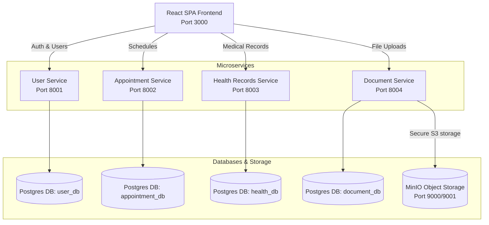

# 🏥 MediLink Hub

Welcome to **MediLink Hub**, a premium, production-grade microservices-based healthcare platform designed to streamline doctor-patient scheduling, medical record tracking, and secure clinical document management. 

Featuring a modern **Glassmorphism SPA Dashboard** built in React (Vite) and orchestrating multiple independent **FastAPI microservices** using Docker, this platform is optimized for local development and ready for Amazon EKS deployment.

---

## 🏗️ Architecture Overview

MediLink Hub is architected following strict microservices principles. Each service runs in isolation, manages its own dedicated PostgreSQL database, and communicates via defined REST APIs.



---

## 🌟 Key Features

### 🔐 User Service & RBAC (Port `8001`)
* **Role-Based Access Control (RBAC):** Strictly distinguishes between `patient`, `doctor`, and `admin` accounts.
* **Token Authentication:** Secure JWT-based session handling.
* **Security & Input Guardrails:** Hardened against high-entropy bcrypt limits (72-byte strict length validation & programmatic truncation).

### 📅 Appointment Scheduling (Port `8002`)
* **Interactive Booking Engine:** Custom mini-calendar and time-slot allocator designed for seamless UX.
* **Timezone Safety:** Active normalization converting incoming ISO strings to offset-naive UTC dates to prevent comparison conflicts with PostgreSQL.
* **State Management:** Fully supports creating, pending, approving, and canceling clinical appointments.

### 🩺 Health Records (Port `8003`)
* **Doctor Privilege Only:** Only accounts with the `doctor` role are permitted to create health logs and diagnostics.
* **Patient View Only:** Patients can securely view their records but cannot mutate or add medical histories.

### 📁 Clinical Document Management (Port `8004`)
* **Object Store Integration:** Seamless connection to **MinIO** (S3 compatible) for uploading and retrieving medical attachments.
* **Safe Storage Paths:** Dynamically creates buckets (`medilink-docs`) and tracks file metadata securely in PostgreSQL.

### 🎨 Premium Frontend Dashboard (Port `3000`)
* **Modern Design Language:** Tailored Glassmorphism aesthetics with deep HSL dark modes, responsive layouts, and rich micro-interactions.
* **Zero Page-Reloads:** Utilizes React Router for highly responsive SPA routing.
* **Interactive Widgets:** A bespoke mini calendar & scrollable 30-minute interval time grid replacing native date pickers.

---

## 🛠️ Technology Stack

| Layer | Component | Technologies |
| :--- | :--- | :--- |
| **Frontend** | UI & SPA Logic | React (Vite), React Router v6, Lucide React, HSL Custom Variables |
| **Backend** | API Services | FastAPI, Pydantic v2, SQLAlchemy, Uvicorn |
| **Databases** | Relational Storage | PostgreSQL 15 (dedicated databases) |
| **Object Store**| File Repository | MinIO (Amazon S3 API Compatible) |
| **Orchestration**| Container Management | Docker, Docker Compose |

---

## 🚀 Quick Start Guide

### 📋 Prerequisites
Make sure you have the following installed on your system:
* [Docker Desktop](https://www.docker.com/products/docker-desktop/) (includes Compose)
* [Git](https://git-scm.com/)

### ⚡ Step-by-Step Launch
1. **Clone the Repository:**
   ```bash
   git clone https://github.com/yourusername/medilink-hub.git
   cd medilink-hub
   ```

2. **Boot the Local Stack:**
   ```bash
   docker compose up --build
   ```
   *This command will automatically download the necessary images, build all FastAPI services and the React frontend, spin up PostgreSQL and MinIO databases, execute health checks, and expose the services locally.*

3. **Verify running containers:**
   ```bash
   docker compose ps
   ```

4. **Access the Apps:**
   * **React Dashboard UI:** [http://localhost:3000](http://localhost:3000)
   * **MinIO Storage Console:** [http://localhost:9001](http://localhost:9001) (User: `minio` | Password: `minio123`)

---

## 🔑 Test Credentials

To test role-based capabilities, you can register or log in using these preset accounts:

### 🩺 Doctor Account (Can write Health Records, Cannot Book Appointments)
* **Email:** `doctor@medilink.com`
* **Password:** `password123`
* **Role:** `doctor`

### 👤 Patient Account (Can Book Appointments, Cannot Write Health Records)
* **Email:** `patient@medilink.com`
* **Password:** `password123`
* **Role:** `patient`

---

## 🔧 Developing Locally & Hot-Reload

The `docker-compose.yml` config is optimized for swift local development:
* **Frontend Hot Reload:** The source files are volume-mounted (`./frontend/src:/app/src`), meaning edits to any React component instantly reflect in your browser.
* **Independent Rebuilds:** If you alter backend code in `appointment-service`, run:
  ```bash
  docker compose up --build -d appointment-service
  ```

---

## 🛠️ Troubleshoot & Fix Reference

Below are fixes for issues resolved during production testing:
* **Bcrypt Incompatibility:** Pinned `bcrypt==3.2.2` alongside `passlib[bcrypt]==1.7.4` to avoid `AttributeError: module 'bcrypt' has no attribute '__about__'`.
* **DateTime Shadowing:** Avoided namespace clashes in SQLAlchemy models by importing standard datetimes as `import datetime as dt`.
* **Datetime Timezone Clashes:** Programmatically converted timezone-aware ISO string formats into offset-naive UTC dates inside `appointment-service` validator checks prior to inserting into PostgreSQL tables.

---

## 📈 Roadmap to AWS EKS
1. **Container Registry:** Push microservice Docker images to Amazon ECR.
2. **Database Provisioning:** Migrate local PostgreSQL containers to highly available Amazon RDS.
3. **Storage Migration:** Transition MinIO objects directly to secure AWS S3 buckets.
4. **Kubernetes Manifests:** Create Deployment, Service, and Ingress manifests for deploying onto an Amazon EKS Cluster.

---

*Made with ❤️ by the MediLink Hub Engineering Team.*
