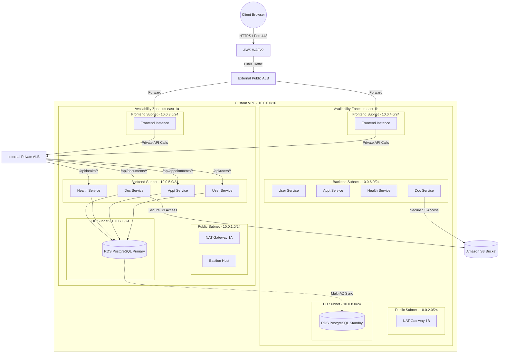

# 🏥 Production-Grade AWS 3-Tier Deployment Plan for MediLink Hub

This implementation plan details the end-to-end strategy, architectural components, and complete automation scripts (Terraform) required to securely deploy the **MediLink Hub** microservices suite on AWS in a highly available, robust, and compliant 3-Tier architecture.

---

## 🏗️ 1. Core Architectural Overview

We will design a custom VPC spanning two Availability Zones (`us-east-1a` and `us-east-1b`) in the `us-east-1` region. Network segmentation will isolate the public entrypoints, frontend web tier, backend application microservices, and databases into separate subnets with rigid security boundaries.



---

## 🔒 2. Multi-Tier Security Group Design

We implement a zero-trust network topology using least-privilege security groups:

| Security Group | Source Allowed | Ports Allowed | Purpose |
| :--- | :--- | :--- | :--- |
| **`bastion-sg`** | User's Specific IP | `22` (SSH) | Administrative SSH Access |
| **`external-alb-sg`** | Anywhere (`0.0.0.0/0`) | `80`, `443` (HTTP/HTTPS) | Client entrypoint (monitored by WAF) |
| **`frontend-asg-sg`** | `external-alb-sg` | `3000` (React Node) | Frontend Web Instances |
| **`internal-alb-sg`** | `frontend-asg-sg` | `80`, `443` | Private Load Balancing for APIs |
| **`backend-asg-sg`** | `internal-alb-sg` | `8001`, `8002`, `8003`, `8004` | API Microservices |
| **`rds-sg`** | `backend-asg-sg`, `bastion-sg` | `5432` (PostgreSQL) | Database isolation |

---

## 📅 3. Domain & Path-Based Load Balancing Logic

### External ALB (Internet-Facing)
* **Default Action:** Renders a beautiful custom-styled **HTML Fixed Response** (Status Code `503` Service Unavailable) representing a maintenance/holding page.
* **Listener Rule 1:** Match hosts like `medilink.yourdomain.com` or `*.medilink.yourdomain.com` to forward all traffic to the Frontend ASG target group.

### Internal ALB (Private VPC-Only)
* **Path-Based Routing:**
  * Requests matching `/api/users/*` -> Target Group `user-service-tg` (Port `8001`)
  * Requests matching `/api/appointments/*` -> Target Group `appointment-service-tg` (Port `8002`)
  * Requests matching `/api/health/*` -> Target Group `health-service-tg` (Port `8003`)
  * Requests matching `/api/documents/*` -> Target Group `document-service-tg` (Port `8004`)
* **Domain-Based Example Integration:**
  * Hosts matching `api-internal.medilink.com` route to the services using the path criteria.

---

## 🚀 4. Step-by-Step Execution Plan

### Step 1: Secure Object Store (S3 Bucket & IAM Profiles)
Replace local MinIO configuration in the code natively with AWS S3 using Boto3 (Completed!).
Configure an IAM Instance Profile containing an IAM Role with a policy granting `s3:PutObject`, `s3:GetObject`, and `s3:ListBucket` to the private AWS S3 bucket. Associate this role with the Backend launch templates so the instances can securely access S3 without keeping long-lived credentials in code.

### Step 2: Build Production AMIs (Amazon Machine Images)
Create custom AMIs for the web and application tiers:
1. **Frontend Web AMI:**
   * Install Node.js 18.
   * Copy the `frontend` production directory.
   * Setup PM2 or systemd to auto-restart the application on boot (`npm run dev -- --host 0.0.0.0 --port 3000`).
   * Save the EC2 instance as an AMI named `medilink-frontend-v1`.
2. **Backend API AMI:**
   * Install Python 3.11, PostgreSQL-client, and libpq dependencies.
   * Pull code for the four microservices (`user-service`, `appointment-service`, `health-service`, `document-service`).
   * Install requirements (`pip install -r requirements.txt`).
   * Setup a systemd service file to manage the execution of the FastAPI services on boot.
   * Save as an AMI named `medilink-backend-v1`.

### Step 3: Spin up Databases (RDS Setup)
Launch an Amazon RDS PostgreSQL 15 Instance with Multi-AZ (Active/Standby replication) spanning AZs `1a` and `1b` inside private DB subnets. Securely initialize the four microservices databases (`user_db`, `appointment_db`, `health_db`, `document_db`) during instance setup.

### Step 4: Automate Infrastructure (Terraform Deployment)
Initialize and execute the Terraform scripts below to spin up VPC networking, WAF, load balancers, auto-scaling groups, target groups, and RDS.

---

## 📁 5. Complete Terraform Automation Scripts

Create a dedicated directory `terraform` under your workspace root and populate the following files.

### 1. `providers.tf`
```hcl
terraform {
  required_version = ">= 1.5.0"
  required_providers {
    aws = {
      source  = "hashicorp/aws"
      version = "~> 5.0"
    }
  }
}

provider "aws" {
  region = "us-east-1"
  default_tags {
    tags = {
      Environment = "Production"
      Project     = "MediLink-Hub"
      ManagedBy   = "Terraform"
    }
  }
}
```

### 2. `vpc.tf`
```hcl
locals {
  az_a = "us-east-1a"
  az_b = "us-east-1b"
}

# --- VPC ---
resource "aws_vpc" "main" {
  cidr_block           = "10.0.0.0/16"
  enable_dns_hostnames = true
  enable_dns_support   = true

  tags = { Name = "medilink-vpc" }
}

# --- Internet Gateway ---
resource "aws_internet_gateway" "igw" {
  vpc_id = aws_vpc.main.id
  tags   = { Name = "medilink-igw" }
}

# --- Subnets ---
# Public Subnets (Bastion, NAT Gateways)
resource "aws_subnet" "public_a" {
  vpc_id            = aws_vpc.main.id
  cidr_block        = "10.0.1.0/24"
  availability_zone = local.az_a
  map_public_ip_on_launch = true
  tags              = { Name = "medilink-public-1a" }
}

resource "aws_subnet" "public_b" {
  vpc_id            = aws_vpc.main.id
  cidr_block        = "10.0.2.0/24"
  availability_zone = local.az_b
  map_public_ip_on_launch = true
  tags              = { Name = "medilink-public-1b" }
}

# Private Subnets (Frontend App)
resource "aws_subnet" "private_front_a" {
  vpc_id            = aws_vpc.main.id
  cidr_block        = "10.0.3.0/24"
  availability_zone = local.az_a
  tags              = { Name = "medilink-private-front-1a" }
}

resource "aws_subnet" "private_front_b" {
  vpc_id            = aws_vpc.main.id
  cidr_block        = "10.0.4.0/24"
  availability_zone = local.az_b
  tags              = { Name = "medilink-private-front-1b" }
}

# Private Subnets (Backend APIs)
resource "aws_subnet" "private_back_a" {
  vpc_id            = aws_vpc.main.id
  cidr_block        = "10.0.5.0/24"
  availability_zone = local.az_a
  tags              = { Name = "medilink-private-back-1a" }
}

resource "aws_subnet" "private_back_b" {
  vpc_id            = aws_vpc.main.id
  cidr_block        = "10.0.6.0/24"
  availability_zone = local.az_b
  tags              = { Name = "medilink-private-back-1b" }
}

# Private Subnets (RDS Databases)
resource "aws_subnet" "private_db_a" {
  vpc_id            = aws_vpc.main.id
  cidr_block        = "10.0.7.0/24"
  availability_zone = local.az_a
  tags              = { Name = "medilink-private-db-1a" }
}

resource "aws_subnet" "private_db_b" {
  vpc_id            = aws_vpc.main.id
  cidr_block        = "10.0.8.0/24"
  availability_zone = local.az_b
  tags              = { Name = "medilink-private-db-1b" }
}

# --- NAT Gateways (High Availability) ---
resource "aws_eip" "nat_a" {
  domain = "vpc"
}

resource "aws_eip" "nat_b" {
  domain = "vpc"
}

resource "aws_nat_gateway" "nat_a" {
  allocation_id = aws_eip.nat_a.id
  subnet_id     = aws_subnet.public_a.id
  tags          = { Name = "medilink-nat-1a" }
}

resource "aws_nat_gateway" "nat_b" {
  allocation_id = aws_eip.nat_b.id
  subnet_id     = aws_subnet.public_b.id
  tags          = { Name = "medilink-nat-1b" }
}

# --- Route Tables & Associations ---
# Public Route Table
resource "aws_route_table" "public" {
  vpc_id = aws_vpc.main.id
  route {
    cidr_block = "0.0.0.0/0"
    gateway_id = aws_internet_gateway.igw.id
  }
  tags = { Name = "medilink-public-rt" }
}

resource "aws_route_table_association" "public_a" {
  subnet_id      = aws_subnet.public_a.id
  route_table_id = aws_route_table.public.id
}

resource "aws_route_table_association" "public_b" {
  subnet_id      = aws_subnet.public_b.id
  route_table_id = aws_route_table.public.id
}

# Private Route Table A (via NAT A)
resource "aws_route_table" "private_a" {
  vpc_id = aws_vpc.main.id
  route {
    cidr_block     = "0.0.0.0/0"
    nat_gateway_id = aws_nat_gateway.nat_a.id
  }
  tags = { Name = "medilink-private-rt-1a" }
}

resource "aws_route_table_association" "front_a" {
  subnet_id      = aws_subnet.private_front_a.id
  route_table_id = aws_route_table.private_a.id
}

resource "aws_route_table_association" "back_a" {
  subnet_id      = aws_subnet.private_back_a.id
  route_table_id = aws_route_table.private_a.id
}

# Private Route Table B (via NAT B)
resource "aws_route_table" "private_b" {
  vpc_id = aws_vpc.main.id
  route {
    cidr_block     = "0.0.0.0/0"
    nat_gateway_id = aws_nat_gateway.nat_b.id
  }
  tags = { Name = "medilink-private-rt-1b" }
}

resource "aws_route_table_association" "front_b" {
  subnet_id      = aws_subnet.private_front_b.id
  route_table_id = aws_route_table.private_b.id
}

resource "aws_route_table_association" "back_b" {
  subnet_id      = aws_subnet.private_back_b.id
  route_table_id = aws_route_table.private_b.id
}
```

### 3. `security_groups.tf`
```hcl
# --- Bastion Security Group ---
resource "aws_security_group" "bastion" {
  name        = "medilink-bastion-sg"
  description = "Allow inbound SSH access to admin host"
  vpc_id      = aws_vpc.main.id

  ingress {
    description = "SSH administrative access"
    from_port   = 22
    to_port     = 22
    protocol    = "tcp"
    cidr_blocks = ["0.0.0.0/0"] # Change to your office or home IP for safety
  }

  egress {
    from_port   = 0
    to_port     = 0
    protocol    = "-1"
    cidr_blocks = ["0.0.0.0/0"]
  }

  tags = { Name = "medilink-bastion-sg" }
}

# --- External Load Balancer Security Group ---
resource "aws_security_group" "external_alb" {
  name        = "medilink-external-alb-sg"
  description = "Allows public web traffic to external load balancer"
  vpc_id      = aws_vpc.main.id

  ingress {
    description = "Public HTTP"
    from_port   = 80
    to_port     = 80
    protocol    = "tcp"
    cidr_blocks = ["0.0.0.0/0"]
  }

  ingress {
    description = "Public HTTPS"
    from_port   = 443
    to_port     = 443
    protocol    = "tcp"
    cidr_blocks = ["0.0.0.0/0"]
  }

  egress {
    from_port   = 0
    to_port     = 0
    protocol    = "-1"
    cidr_blocks = ["0.0.0.0/0"]
  }

  tags = { Name = "medilink-external-alb-sg" }
}

# --- Frontend Web Security Group ---
resource "aws_security_group" "frontend_asg" {
  name        = "medilink-frontend-sg"
  description = "Allows traffic only from external load balancer"
  vpc_id      = aws_vpc.main.id

  ingress {
    from_port       = 3000
    to_port         = 3000
    protocol        = "tcp"
    security_groups = [aws_security_group.external_alb.id]
  }

  ingress {
    from_port       = 22
    to_port         = 22
    protocol        = "tcp"
    security_groups = [aws_security_group.bastion.id]
  }

  egress {
    from_port   = 0
    to_port     = 0
    protocol    = "-1"
    cidr_blocks = ["0.0.0.0/0"]
  }

  tags = { Name = "medilink-frontend-sg" }
}

# --- Internal Load Balancer Security Group ---
resource "aws_security_group" "internal_alb" {
  name        = "medilink-internal-alb-sg"
  description = "Allows traffic from frontend hosts to backend services"
  vpc_id      = aws_vpc.main.id

  ingress {
    from_port       = 80
    to_port         = 80
    protocol        = "tcp"
    security_groups = [aws_security_group.frontend_asg.id]
  }

  egress {
    from_port   = 0
    to_port     = 0
    protocol    = "-1"
    cidr_blocks = ["0.0.0.0/0"]
  }

  tags = { Name = "medilink-internal-alb-sg" }
}

# --- Backend API Security Group ---
resource "aws_security_group" "backend_asg" {
  name        = "medilink-backend-sg"
  description = "Allows traffic from internal load balancer and admin host"
  vpc_id      = aws_vpc.main.id

  # Microservices Ports
  ingress {
    description     = "User service endpoint"
    from_port       = 8001
    to_port         = 8001
    protocol        = "tcp"
    security_groups = [aws_security_group.internal_alb.id]
  }

  ingress {
    description     = "Appointment service endpoint"
    from_port       = 8002
    to_port         = 8002
    protocol        = "tcp"
    security_groups = [aws_security_group.internal_alb.id]
  }

  ingress {
    description     = "Health records service endpoint"
    from_port       = 8003
    to_port         = 8003
    protocol        = "tcp"
    security_groups = [aws_security_group.internal_alb.id]
  }

  ingress {
    description     = "Document management service endpoint"
    from_port       = 8004
    to_port         = 8004
    protocol        = "tcp"
    security_groups = [aws_security_group.internal_alb.id]
  }

  ingress {
    description     = "Administrative SSH access"
    from_port       = 22
    to_port         = 22
    protocol        = "tcp"
    security_groups = [aws_security_group.bastion.id]
  }

  egress {
    from_port   = 0
    to_port     = 0
    protocol    = "-1"
    cidr_blocks = ["0.0.0.0/0"]
  }

  tags = { Name = "medilink-backend-sg" }
}

# --- RDS Security Group ---
resource "aws_security_group" "rds" {
  name        = "medilink-rds-sg"
  description = "Allows database connections from backends and admin hosts"
  vpc_id      = aws_vpc.main.id

  ingress {
    description     = "PostgreSQL connections from backend APIs"
    from_port       = 5432
    to_port         = 5432
    protocol        = "tcp"
    security_groups = [aws_security_group.backend_asg.id]
  }

  ingress {
    description     = "PostgreSQL maintenance connections from bastion host"
    from_port       = 5432
    to_port         = 5432
    protocol        = "tcp"
    security_groups = [aws_security_group.bastion.id]
  }

  egress {
    from_port   = 0
    to_port     = 0
    protocol    = "-1"
    cidr_blocks = ["0.0.0.0/0"]
  }

  tags = { Name = "medilink-rds-sg" }
}
```

### 4. `s3.tf`
```hcl
# --- S3 Bucket for Medical Documents ---
resource "aws_s3_bucket" "documents" {
  bucket        = "medilink-docs-production-bucket"
  force_destroy = false
}

# Enable Server Side Encryption
resource "aws_s3_bucket_server_side_encryption_configuration" "documents_enc" {
  bucket = aws_s3_bucket.documents.id
  rule {
    apply_server_side_encryption_by_default {
      sse_algorithm = "AES256"
    }
  }
}

# Block all Public Access to keep clinical records strictly private
resource "aws_s3_bucket_public_access_block" "documents_block" {
  bucket                  = aws_s3_bucket.documents.id
  block_public_acls       = true
  block_public_policy     = true
  ignore_public_acls      = true
  restrict_public_buckets = true
}

# --- IAM Policy for Private EC2 Instances to Access S3 Bucket ---
resource "aws_iam_role" "backend_s3" {
  name = "medilink-backend-s3-role"

  assume_role_policy = jsonencode({
    Version = "2012-10-17"
    Statement = [
      {
        Action = "sts:AssumeRole"
        Effect = "Allow"
        Principal = {
          Service = "ec2.amazonaws.com"
        }
      }
    ]
  })
}

resource "aws_iam_policy" "s3_access" {
  name        = "medilink-s3-access-policy"
  description = "Permits document service instances to upload and read medical files"

  policy = jsonencode({
    Version = "2012-10-17"
    Statement = [
      {
        Effect = "Allow"
        Action = [
          "s3:PutObject",
          "s3:GetObject",
          "s3:DeleteObject"
        ]
        Resource = "${aws_s3_bucket.documents.arn}/*"
      },
      {
        Effect = "Allow"
        Action = [
          "s3:ListBucket"
        ]
        Resource = aws_s3_bucket.documents.arn
      }
    ]
  })
}

resource "aws_iam_role_policy_attachment" "backend_s3" {
  role       = aws_iam_role.backend_s3.name
  policy_arn = aws_iam_policy.s3_access.arn
}

resource "aws_iam_instance_profile" "backend" {
  name = "medilink-backend-instance-profile"
  role = aws_iam_role.backend_s3.name
}
```

### 5. `rds.tf`
```hcl
# --- DB Subnet Group ---
resource "aws_db_subnet_group" "rds" {
  name       = "medilink-db-subnet-group"
  subnet_ids = [aws_subnet.private_db_a.id, aws_subnet.private_db_b.id]
  tags       = { Name = "medilink-db-subnet-group" }
}

# --- Multi-AZ DB Cluster (High Availability Setup) ---
resource "aws_db_instance" "postgres" {
  identifier             = "medilink-production-db"
  allocated_storage      = 20
  max_allocated_storage  = 100
  db_name                = "postgres" # Initial DB
  engine                 = "postgres"
  engine_version         = "15.7"
  instance_class         = "db.t3.micro"
  username               = "dbadmin"
  password               = "ProductionStrongPassword123!" # Ideally fetched from SSM Parameter Store/Secrets Manager
  db_subnet_group_name   = aws_db_subnet_group.rds.name
  vpc_security_group_ids = [aws_security_group.rds.id]
  multi_az               = true # High availability active-standby database
  skip_final_snapshot    = true

  tags = { Name = "medilink-rds-postgres" }
}
```

### 6. `load_balancers.tf`
```hcl
# --- External Web Application Firewall (WAF) ---
resource "aws_wafv2_web_acl" "waf" {
  name        = "medilink-production-waf"
  description = "Protects frontend web interface from malicious injection and bots"
  scope       = "REGIONAL"

  default_action {
    allow {}
  }

  # AWS Managed Common Rule Set
  rule {
    name     = "AWSManagedRulesCommonRuleSet"
    priority = 1

    override_action {
      none {}
    }

    statement {
      managed_rule_group_statement {
        name        = "AWSManagedRulesCommonRuleSet"
        vendor_name = "AWS"
      }
    }

    visibility_config {
      cloudwatch_metrics_enabled = true
      metric_name                = "AWSManagedRulesCommonRuleSetMetric"
      sampled_requests_enabled   = true
    }
  }

  visibility_config {
    cloudwatch_metrics_enabled = true
    metric_name                = "medilinkWafMetric"
    sampled_requests_enabled   = true
  }
}

# --- External Public Load Balancer ---
resource "aws_lb" "external" {
  name               = "medilink-external-alb"
  internal           = false
  load_balancer_type = "application"
  security_groups    = [aws_security_group.external_alb.id]
  subnets            = [aws_subnet.public_a.id, aws_subnet.public_b.id]
  tags               = { Name = "medilink-external-alb" }
}

# Connect WAF to External Load Balancer
resource "aws_wafv2_web_acl_association" "external_lb" {
  resource_arn = aws_lb.external.arn
  web_acl_arn  = aws_wafv2_web_acl.waf.arn
}

# --- Target Groups ---
# Frontend Target Group
resource "aws_lb_target_group" "frontend" {
  name        = "medilink-frontend-tg"
  port        = 3000
  protocol    = "HTTP"
  vpc_id      = aws_vpc.main.id
  target_type = "instance"

  health_check {
    path                = "/"
    interval            = 30
    timeout             = 5
    healthy_threshold   = 3
    unhealthy_threshold = 3
    matcher             = "200-399"
  }
}

# --- Listeners & Routing Rules (External) ---
resource "aws_lb_listener" "external_http" {
  load_balancer_arn = aws_lb.external.arn
  port              = "80"
  protocol          = "HTTP"

  # Premium Feature: Fallback holding/maintenance response styled cleanly
  default_action {
    type = "fixed-response"

    fixed_response {
      content_type = "text/html"
      message_body = <<HTML
<!DOCTYPE html>
<html>
<head>
  <title>MediLink Hub - Under Maintenance</title>
  <style>
    body { background: #0b0f19; color: #f3f4f6; font-family: system-ui, sans-serif; display: flex; justify-content: center; align-items: center; height: 100vh; margin: 0; }
    .card { background: rgba(255,255,255,0.05); border: 1px solid rgba(255,255,255,0.1); border-radius: 12px; padding: 40px; max-width: 480px; text-align: center; box-shadow: 0 8px 32px rgba(0,0,0,0.5); backdrop-filter: blur(10px); }
    h1 { color: #6366f1; font-weight: 700; margin-top: 0; }
    p { line-height: 1.6; color: #9ca3af; }
    .footer { margin-top: 24px; font-size: 0.8rem; color: #4b5563; }
  </style>
</head>
<body>
  <div class="card">
    <h1>MediLink Hub Undergoing Maintenance</h1>
    <p>We are updating our medical interfaces to better serve patients and doctors. Please check back shortly.</p>
    <div class="footer">MediLink Cloud Operations Team</div>
  </div>
</body>
</html>
HTML
      status_code  = "503"
    }
  }
}

# Domain-Based Routing Rule
resource "aws_lb_listener_rule" "domain_routing" {
  listener_arn = aws_lb_listener.external_http.arn
  priority     = 100

  action {
    type             = "forward"
    target_group_arn = aws_lb_target_group.frontend.arn
  }

  # Example domain hosting: Forward requests only for medilink.yourdomain.com
  condition {
    host_header {
      values = ["medilink.yourdomain.com", "*.medilink.yourdomain.com"]
    }
  }
}

# --- Internal Private Load Balancer ---
resource "aws_lb" "internal" {
  name               = "medilink-internal-alb"
  internal           = true
  load_balancer_type = "application"
  security_groups    = [aws_security_group.internal_alb.id]
  subnets            = [aws_subnet.private_back_a.id, aws_subnet.private_back_b.id]
  tags               = { Name = "medilink-internal-alb" }
}

# --- Microservices Target Groups ---
resource "aws_lb_target_group" "user_service" {
  name        = "medilink-user-tg"
  port        = 8001
  protocol    = "HTTP"
  vpc_id      = aws_vpc.main.id
  target_type = "instance"
  health_check {
    path = "/health"
    port = "8001"
  }
}

resource "aws_lb_target_group" "appointment_service" {
  name        = "medilink-appointment-tg"
  port        = 8002
  protocol    = "HTTP"
  vpc_id      = aws_vpc.main.id
  target_type = "instance"
  health_check {
    path = "/health"
    port = "8002"
  }
}

resource "aws_lb_target_group" "health_service" {
  name        = "medilink-health-tg"
  port        = 8003
  protocol    = "HTTP"
  vpc_id      = aws_vpc.main.id
  target_type = "instance"
  health_check {
    path = "/health"
    port = "8003"
  }
}

resource "aws_lb_target_group" "document_service" {
  name        = "medilink-document-tg"
  port        = 8004
  protocol    = "HTTP"
  vpc_id      = aws_vpc.main.id
  target_type = "instance"
  health_check {
    path = "/health"
    port = "8004"
  }
}

# --- Internal Listener & Path-Based Routing ---
resource "aws_lb_listener" "internal_http" {
  load_balancer_arn = aws_lb.internal.arn
  port              = "80"
  protocol          = "HTTP"

  default_action {
    type = "fixed-response"
    fixed_response {
      content_type = "application/json"
      message_body = "{\"error\": \"Invalid microservice API path request\"}"
      status_code  = "404"
    }
  }
}

# User Service Path Rule
resource "aws_lb_listener_rule" "users" {
  listener_arn = aws_lb_listener.internal_http.arn
  priority     = 10

  action {
    type             = "forward"
    target_group_arn = aws_lb_target_group.user_service.arn
  }

  condition {
    path_pattern {
      values = ["/api/users/*", "/users/*", "/login", "/register", "/me"]
    }
  }
}

# Appointment Service Path Rule
resource "aws_lb_listener_rule" "appointments" {
  listener_arn = aws_lb_listener.internal_http.arn
  priority     = 20

  action {
    type             = "forward"
    target_group_arn = aws_lb_target_group.appointment_service.arn
  }

  condition {
    path_pattern {
      values = ["/api/appointments/*", "/appointments/*"]
    }
  }
}

# Health Service Path Rule
resource "aws_lb_listener_rule" "health" {
  listener_arn = aws_lb_listener.internal_http.arn
  priority     = 30

  action {
    type             = "forward"
    target_group_arn = aws_lb_target_group.health_service.arn
  }

  condition {
    path_pattern {
      values = ["/api/records/*", "/records/*"]
    }
  }
}

# Document Service Path Rule
resource "aws_lb_listener_rule" "documents" {
  listener_arn = aws_lb_listener.internal_http.arn
  priority     = 40

  action {
    type             = "forward"
    target_group_arn = aws_lb_target_group.document_service.arn
  }

  condition {
    path_pattern {
      values = ["/api/documents/*", "/documents/*"]
    }
  }
}
```

### 7. `autoscaling.tf`
```hcl
# --- Launch Templates ---

# Frontend Launch Template
resource "aws_launch_template" "frontend" {
  name_prefix   = "medilink-frontend-"
  image_id      = var.frontend_ami_id
  instance_type = "t3.micro"
  key_name      = var.key_name

  network_interfaces {
    associate_public_ip_address = false
    security_groups             = [aws_security_group.frontend_asg.id]
  }

  user_data = base64encode(<<-EOF
              #!/bin/bash
              echo "Starting PM2 or React server..."
              cd /home/ec2-user/medilink-frontend
              # Set backend Internal ALB URL
              export VITE_USER_URL="http://${aws_lb.internal.dns_name}:8001"
              export VITE_APPOINTMENT_URL="http://${aws_lb.internal.dns_name}:8002"
              export VITE_HEALTH_URL="http://${aws_lb.internal.dns_name}:8003"
              export VITE_DOCUMENT_URL="http://${aws_lb.internal.dns_name}:8004"
              npm run dev -- --host 0.0.0.0 --port 3000
              EOF
  )

  tag_specifications {
    resource_type = "instance"
    tags          = { Name = "medilink-frontend-asg-instance" }
  }
}

# Backend Launch Template
resource "aws_launch_template" "backend" {
  name_prefix   = "medilink-backend-"
  image_id      = var.backend_ami_id
  instance_type = "t3.micro"
  key_name      = var.key_name

  iam_instance_profile {
    name = aws_iam_instance_profile.backend.name
  }

  network_interfaces {
    associate_public_ip_address = false
    security_groups             = [aws_security_group.backend_asg.id]
  }

  user_data = base64encode(<<-EOF
              #!/bin/bash
              echo "Starting MediLink microservices..."
              export DATABASE_URL="postgresql+asyncpg://dbadmin:ProductionStrongPassword123!@${aws_db_instance.postgres.endpoint}/"
              export S3_BUCKET_NAME="${aws_s3_bucket.documents.bucket}"
              export S3_ENDPOINT="" # Leave empty for native AWS S3
              export AWS_DEFAULT_REGION="us-east-1"
              export JWT_SECRET="supersecret"

              # Run each service using systemd or simple background execution for this AMI
              cd /home/ec2-user/user-service && uvicorn main:app --host 0.0.0.0 --port 8001 &
              cd /home/ec2-user/appointment-service && uvicorn main:app --host 0.0.0.0 --port 8002 &
              cd /home/ec2-user/health-service && uvicorn main:app --host 0.0.0.0 --port 8003 &
              cd /home/ec2-user/document-service && uvicorn main:app --host 0.0.0.0 --port 8004 &
              EOF
  )

  tag_specifications {
    resource_type = "instance"
    tags          = { Name = "medilink-backend-asg-instance" }
  }
}

# --- Auto Scaling Groups ---

# Frontend Auto Scaling Group (Private subnets AZ A & B)
resource "aws_autoscaling_group" "frontend" {
  name                = "medilink-frontend-asg"
  vpc_zone_identifier = [aws_subnet.private_front_a.id, aws_subnet.private_front_b.id]
  target_group_arns   = [aws_lb_target_group.frontend.arn]

  min_size         = 2
  max_size         = 5
  desired_capacity = 2

  launch_template {
    id      = aws_launch_template.frontend.id
    version = "$Latest"
  }

  health_check_type         = "ELB"
  health_check_grace_period = 300

  tag {
    key                 = "Name"
    value               = "medilink-frontend-server"
    propagate_at_launch = true
  }
}

# Backend Auto Scaling Group (Private subnets AZ A & B)
resource "aws_autoscaling_group" "backend" {
  name                = "medilink-backend-asg"
  vpc_zone_identifier = [aws_subnet.private_back_a.id, aws_subnet.private_back_b.id]
  
  target_group_arns   = [
    aws_lb_target_group.user_service.arn,
    aws_lb_target_group.appointment_service.arn,
    aws_lb_target_group.health_service.arn,
    aws_lb_target_group.document_service.arn
  ]

  min_size         = 2
  max_size         = 6
  desired_capacity = 2

  launch_template {
    id      = aws_launch_template.backend.id
    version = "$Latest"
  }

  health_check_type         = "ELB"
  health_check_grace_period = 300

  tag {
    key                 = "Name"
    value               = "medilink-backend-server"
    propagate_at_launch = true
  }
}
```

### 8. `outputs.tf`
```hcl
output "vpc_id" {
  description = "The ID of the VPC"
  value       = aws_vpc.main.id
}

output "external_alb_dns" {
  description = "Public domain to access MediLink Hub"
  value       = aws_lb.external.dns_name
}

output "internal_alb_dns" {
  description = "Private routing endpoint for backend microservices"
  value       = aws_lb.internal.dns_name
}

output "rds_endpoint" {
  description = "RDS Connection Endpoint"
  value       = aws_db_instance.postgres.endpoint
}

output "s3_bucket_name" {
  description = "S3 Medical Files Bucket Name"
  value       = aws_s3_bucket.documents.bucket
}
```

---

## 🔒 6. Operational Handover & Deployment Steps

1. **Initialize Terraform in the directory:**
   ```bash
   cd terraform
   terraform init
   ```
2. **Review Deployment Plan:**
   ```bash
   terraform plan -var="frontend_ami_id=YOUR_FRONTEND_AMI" -var="backend_ami_id=YOUR_BACKEND_AMI"
   ```
3. **Execute Deployment:**
   ```bash
   terraform apply -var="frontend_ami_id=YOUR_FRONTEND_AMI" -var="backend_ami_id=YOUR_BACKEND_AMI" -auto-approve
   ```
4. **Access the application:** Fetch the `external_alb_dns` output and map your target domains (e.g., in AWS Route 53 or your DNS provider) to this address!
